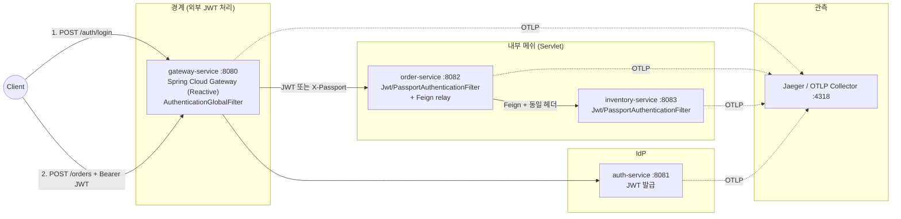
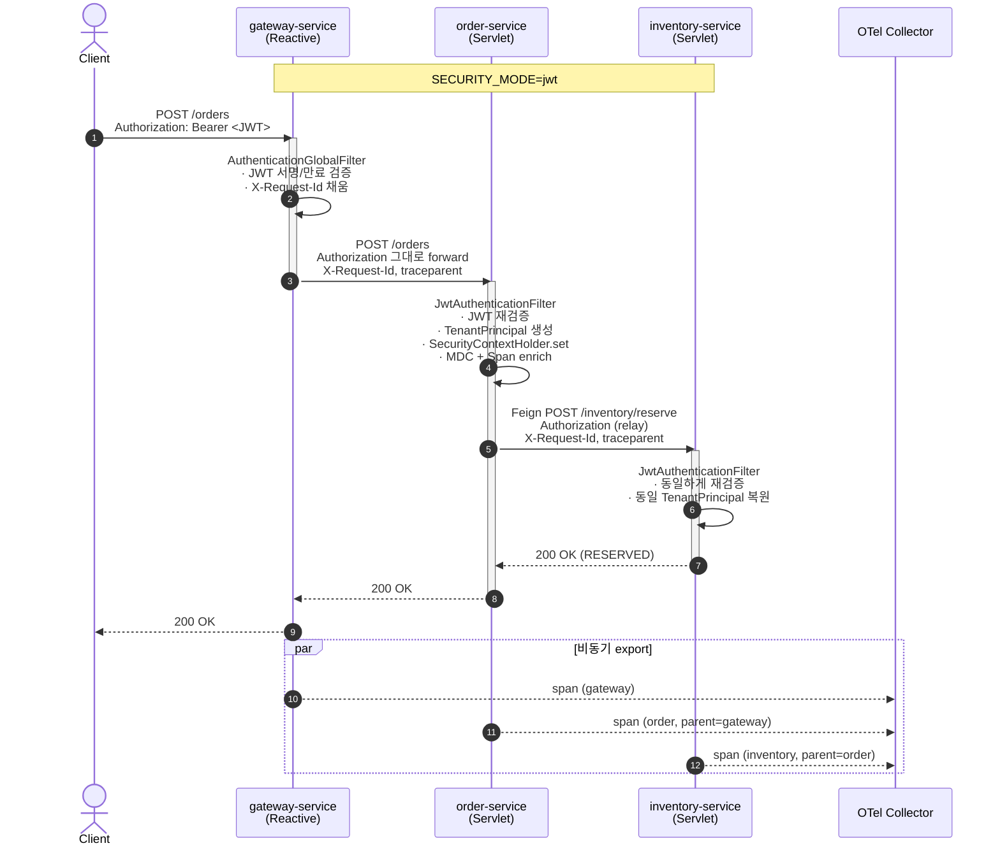
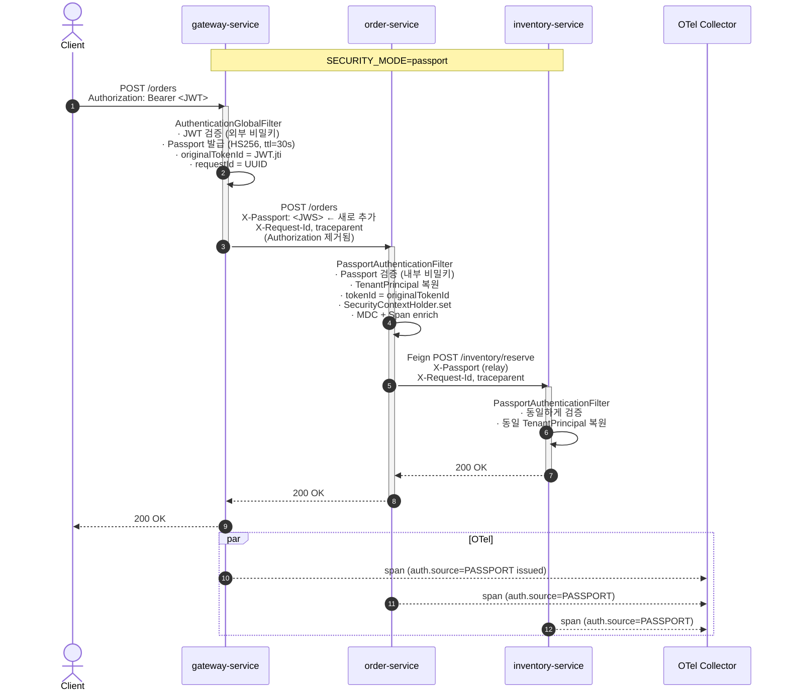
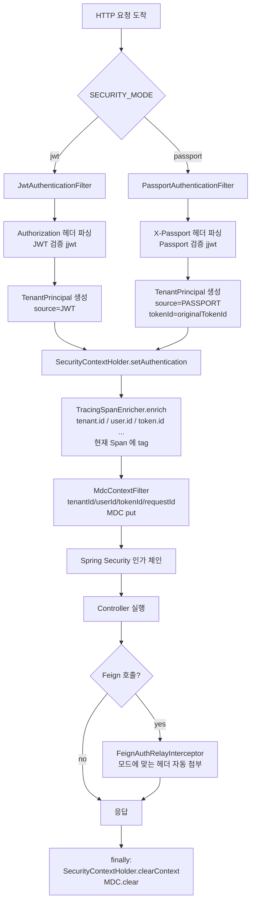
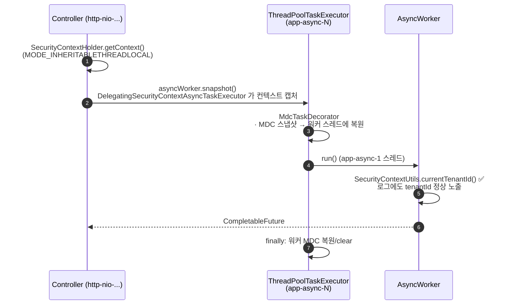

# Spring Security Context — JWT + Gateway Passport (MSA Sample)

MSA 환경에서 **`SecurityContextHolder`** 를 통해
`tenantId / userId / tokenId / requestId` 를 서비스 흐름 전반에 일관되게 유지하는
샘플입니다. 두 가지 인증 흐름을 같은 코드 베이스에서 **환경변수 한 줄**로 전환할
수 있도록 설계했습니다.

| 모드 | 다운스트림 헤더 | 서비스가 검증하는 것 | 외부 IdP 키 노출 | 토큰 수명 |
|---|---|---|---|---|
| `jwt` (기본) | `Authorization: Bearer <JWT>` | 외부 JWT | 모든 서비스 | 30분 (기본) |
| `passport`   | `X-Passport: <JWS>`           | 내부 Passport | 게이트웨이만 | 30초 (기본) |

분산 트레이싱은 Spring Cloud Sleuth 가 아닌 **Micrometer Tracing + OpenTelemetry
(OTLP HTTP)** 로 구성되어 있습니다. 모든 서비스가 동일한 `traceId` 를
공유하고, 인증 필터가 끝난 직후 현재 Span 에 다음 속성이 자동 부착됩니다.

```
tenant.id / user.id / token.id / request.id / auth.source
```

---

## 목차

1. [모듈 구조](#모듈-구조)
2. [컴포넌트 다이어그램](#컴포넌트-다이어그램)
3. [HTTP 요청 플로우 — JWT 모드](#http-요청-플로우--jwt-모드)
4. [HTTP 요청 플로우 — Passport 모드](#http-요청-플로우--passport-모드)
5. [필터 체인 내부 동작](#필터-체인-내부-동작)
6. [토큰 구조](#토큰-구조)
7. [헤더 라이프사이클](#헤더-라이프사이클)
8. [SecurityContext / MDC / OTel Span 의 관계](#securitycontext--mdc--otel-span-의-관계)
9. [@Async 컨텍스트 전파](#async-컨텍스트-전파)
10. [핵심 클래스 매핑](#핵심-클래스-매핑)
11. [빠른 시작](#빠른-시작)
12. [API 카탈로그](#api-카탈로그)
13. [실제 응답/로그 예시](#실제-응답로그-예시)
14. [테스트](#테스트)
15. [트러블슈팅](#트러블슈팅)
16. [알려진 제한](#알려진-제한)

---

## 모듈 구조

```
spring-security-context/
├── common-security/         # Servlet 기반 공통 라이브러리 (필터/리레이/트레이싱/Async)
├── auth-service/            # 8081 - JWT 발급
├── gateway-service/         # 8080 - Spring Cloud Gateway, JWT 검증 + Passport 발급
├── order-service/           # 8082 - Feign 호출 측, @Async 데모
├── inventory-service/       # 8083 - Feign 피호출 측
├── observability/           # docker-compose (Jaeger OTLP collector)
└── scripts/                 # start-all.sh, demo.sh
```

---

## 컴포넌트 다이어그램



---

## HTTP 요청 플로우 — JWT 모드

다운스트림 서비스가 외부 JWT 를 직접 검증합니다.



### 헤더 변화 (JWT 모드)

```
[Client → Gateway]      Authorization: Bearer eyJ...
[Gateway → Order]       Authorization: Bearer eyJ...    (그대로)
                        X-Request-Id: <uuid>
                        traceparent: 00-<traceId>-<spanId>-01
[Order  → Inventory]    Authorization: Bearer eyJ...    (Feign relay)
                        X-Request-Id: <같은 uuid>
                        traceparent: 00-<같은 traceId>-...
```

---

## HTTP 요청 플로우 — Passport 모드

게이트웨이만 외부 JWT 를 검증하고, 내부에는 짧은 수명의 **Passport(JWS)** 를
재발급해서 흘립니다. 내부 서비스는 외부 IdP 키를 알지 못합니다.



### 헤더 변화 (Passport 모드)

```
[Client → Gateway]      Authorization: Bearer eyJ...                       ← 외부 JWT
[Gateway → Order]       X-Passport: eyJ...   (새로 발급)                   ← 내부 JWS
                        X-Request-Id: <uuid>
                        traceparent: 00-<traceId>-<spanId>-01
                        (Authorization 헤더는 의도적으로 제거)
[Order  → Inventory]    X-Passport: eyJ...   (Feign relay, 그대로)
                        X-Request-Id: <같은 uuid>
                        traceparent: 00-<같은 traceId>-...
```

---

## 필터 체인 내부 동작

`order-service` / `inventory-service` 의 한 요청 처리 동안 일어나는 일.



핵심 포인트:
- **하나의 `TenantPrincipal`** 이 두 모드를 모두 표현 → 비즈니스 코드(컨트롤러,
  서비스 레이어)는 모드를 알 필요 없음
- 컨텍스트는 `try / finally` 로 반드시 정리 → 스레드 풀 재사용 시 leak 방지
- OTel Span tag 는 인증 **직후** 부착해서 컨트롤러 진입 시점부터 보임

---

## 토큰 구조

### 외부 JWT (auth-service 발급)

```
Header:  { "alg": "HS256" }
Payload: {
  "iss": "auth-service",
  "jti": "fe8c4be7-9ebc-4e66-9b5d-03c75ba71ed7",
  "sub": "u-1001",
  "tenantId": "tenant-A",
  "userId":   "u-1001",
  "tokenId":  "fe8c4be7-...",
  "roles":    ["USER"],
  "iat": 1700000000,
  "exp": 1700001800
}
```

### 내부 Passport (gateway-service 발급, passport 모드 한정)

```
Header:  { "alg": "HS256" }
Payload: {
  "iss": "gateway-service",
  "jti": "<passport-jti>",
  "sub": "u-1001",
  "tenantId":        "tenant-A",
  "userId":          "u-1001",
  "originalTokenId": "fe8c4be7-...",   ← 외부 JWT 의 jti, 추적 키
  "requestId":       "0e6d003a-...",
  "roles":           ["USER"],
  "iat": 1700000005,
  "exp": 1700000035                     ← 30초 후 만료
}
```

> Passport 의 `originalTokenId` 는 다운스트림에서 그대로 `tokenId` 로 노출되므로,
> 외부 JWT 를 폐기하면 내부 추적 키도 자연스럽게 식별됩니다.

---

## 헤더 라이프사이클

| 단계 | `Authorization` | `X-Passport` | `X-Request-Id` | `traceparent` |
|---|---|---|---|---|
| Client → Gateway | Bearer JWT | — | (선택) | (선택) |
| **JWT 모드** Gateway → Service | Bearer JWT (그대로) | — | UUID 고정 | OTel 자동 |
| **JWT 모드** Service → Service | Bearer JWT (Feign relay) | — | 동일 | 동일 trace, 새 span |
| **Passport 모드** Gateway → Service | **삭제** | 새로 발급 | UUID 고정 | OTel 자동 |
| **Passport 모드** Service → Service | — | 그대로 relay | 동일 | 동일 trace, 새 span |

---

## SecurityContext / MDC / OTel Span 의 관계

세 가지가 같은 인증 정보를 서로 다른 용도로 보유합니다. 인증 필터 안에서 **한
번의 enrich 사이클**로 동시에 채워집니다.

```mermaid
flowchart LR
    F[인증 필터] --> P[TenantPrincipal 생성]
    P --> S[SecurityContextHolder<br/>· 비즈니스 코드 조회용<br/>· @PreAuthorize<br/>· SecurityContextUtils]
    P --> M[MDC<br/>· logback %X{tenantId}<br/>· 모든 로그 라인에 자동 노출]
    P --> O[OTel Span<br/>· tenant.id 등 tag<br/>· Jaeger 검색/필터링]
```

---

## @Async 컨텍스트 전파

`@Async` 워커 스레드에서도 `SecurityContextHolder` 와 MDC 가 그대로 보입니다.



설정 위치: `common-security/.../async/SecurityAwareTaskExecutorConfig.java`

---

## 핵심 클래스 매핑

| 클래스 | 위치 | 역할 |
|---|---|---|
| `TenantPrincipal` | `common-security/context` | `Authentication.getPrincipal()` 에 담기는 record. `userId / tenantId / tokenId / requestId / roles / source(JWT or PASSPORT)` |
| `SecurityContextUtils` | `common-security/context` | `currentTenantId()`, `requirePrincipal()` 같은 정적 헬퍼 |
| `MdcContextFilter` | `common-security/context` | SecurityContext → MDC 동기화 (요청 끝에 clear) |
| `MdcKeys` | `common-security/context` | MDC 키 상수 |
| `JwtTokenProvider` | `common-security/jwt` | JWT 발급/검증 (HS256, jjwt 0.12.x) |
| `JwtAuthenticationFilter` | `common-security/jwt` | jwt 모드 인증 필터 |
| `Passport` | `common-security/passport` | 내부 패스포트 record |
| `PassportIssuer / PassportVerifier` | `common-security/passport` | gateway 발급 / 모든 서비스 검증 |
| `PassportAuthenticationFilter` | `common-security/passport` | passport 모드 인증 필터 |
| `FeignAuthRelayInterceptor` | `common-security/relay` | 모드에 따라 `Authorization` 또는 `X-Passport` 헤더를 outbound 호출에 첨부 |
| `MdcTaskDecorator` | `common-security/async` | `@Async` 워커 스레드에 MDC 복원 |
| `SecurityAwareTaskExecutorConfig` | `common-security/async` | `DelegatingSecurityContextAsyncTaskExecutor` + `MODE_INHERITABLETHREADLOCAL` |
| `TracingSpanEnricher` | `common-security/tracing` | 현재 OTel Span 에 비즈니스 속성 부착 |
| `CommonSecurityAutoConfiguration` | `common-security/autoconfigure` | `@ConditionalOnProperty(app.security.mode)` 로 필터/SecurityFilterChain 자동 구성 |
| `AuthenticationGlobalFilter` | `gateway-service` | JWT 검증 → (passport 모드) Passport 발급 → 헤더 치환 |
| `AuthController` | `auth-service` | `/auth/login` (in-memory user) |

---

## 빠른 시작

### 1. 빌드

```bash
./gradlew build
```

### 2. (선택) Jaeger 기동 — 분산 트레이싱 확인용

```bash
docker compose -f observability/docker-compose.observability.yml up -d
# Jaeger UI: http://localhost:16686
```

### 3. 모드별 실행

```bash
# JWT 모드 (기본)
SECURITY_MODE=jwt ./scripts/start-all.sh

# Passport 모드
SECURITY_MODE=passport ./scripts/start-all.sh
```

### 4. 데모 호출

```bash
./scripts/demo.sh
```

---

## API 카탈로그

| Method | Path | 서비스 | 설명 |
|---|---|---|---|
| `POST` | `/auth/login`              | auth      | `{tenantId,userId}` → JWT 발급 |
| `POST` | `/orders`                  | order     | 주문 생성 + Feign 으로 inventory 호출 |
| `GET`  | `/orders/me`               | order     | 현재 SecurityContext 덤프 |
| `GET`  | `/orders/async-context-check` | order  | `@Async` 워커 스레드의 SecurityContext 덤프 |
| `POST` | `/inventory/reserve`       | inventory | 재고 예약 + 호출자 SecurityContext 에코 |
| `GET`  | `/inventory/me`            | inventory | 현재 SecurityContext 덤프 |
| `GET`  | `/actuator/health`         | 모두      | 헬스체크 |

---

## 실제 응답/로그 예시

### `POST /orders` 응답 (passport 모드)

```json
{
  "orderId": "ord-e27aca4e-...",
  "principal": {
    "tenantId": "tenant-A",
    "userId":   "u-1001",
    "tokenId":  "03aef6a4-...",
    "requestId": "552a5aa8-...",
    "roles": ["USER"],
    "authSource": "PASSPORT",
    "service": "order-service"
  },
  "inventory": {
    "tenantId": "tenant-A",
    "userId":   "u-1001",
    "tokenId":  "03aef6a4-...",     ← 동일
    "requestId": "552a5aa8-...",   ← 동일
    "roles": ["USER"],
    "authSource": "PASSPORT",
    "service": "inventory-service",
    "status": "RESERVED"
  }
}
```

> `tokenId` 가 두 서비스에서 **동일** 하다는 것이 핵심 — Passport 모드에서는
> 외부 JWT 의 `jti` 가 `originalTokenId` 로 보존되어 그대로 노출됩니다.

### 로그 패턴

```
HH:mm:ss.SSS LEVEL [traceId/spanId] [tenantId/userId/tokenId/requestId] [authSource] logger - msg
```

실제 로그 예시:

```
14:40:11.520 INFO  [4f3a.../e1c2...] [tenant-A/u-1001/03aef6a4-.../552a5aa8-...] [PASSPORT] c.e.s.order.OrderController       - creating order ord-e27a... sku=A1 qty=2
14:40:11.602 INFO  [4f3a.../92b8...] [tenant-A/u-1001/03aef6a4-.../552a5aa8-...] [PASSPORT] c.e.s.inventory.InventoryController - reserving sku=A1 qty=2 for orderId=ord-e27a...
```

같은 `traceId` 안에서 두 서비스의 span 이 연결되고, MDC 의 비즈니스 식별자도
일관되게 노출됩니다.

### `GET /orders/async-context-check` 응답

```json
{
  "callerThread": "http-nio-8082-exec-3",
  "workerSnapshot": {
    "workerThread": "app-async-1",
    "tenantId": "tenant-A",
    "userId":   "u-1001",
    "tokenId":  "ad2add7b-..."
  }
}
```

워커 스레드(`app-async-1`)에서도 `SecurityContextHolder` 가 보존됩니다.

---

## 테스트

```bash
./gradlew :common-security:test
```

포함된 테스트:
- `JwtTokenProviderTest` — 발급/파싱 round-trip, 다른 비밀키 거부
- `PassportRoundTripTest` — Passport 발급/검증, 위조 거부

---

## 트러블슈팅

| 증상 | 원인 / 해결 |
|---|---|
| 4 서비스 동시에 띄울 때 `applicationTaskExecutor` Bean 충돌 | `SecurityAwareTaskExecutorConfig` 가 `AsyncConfigurer.getAsyncExecutor()` 로만 노출되도록 작성됨. 직접 `@Bean(name="applicationTaskExecutor")` 으로 정의하면 Spring Boot 자동설정과 충돌함 |
| 게이트웨이가 401 만 응답 | 외부 JWT 비밀키가 서비스마다 다른 경우. `app.security.jwt.secret` 을 모든 서비스에서 동일하게 유지 |
| Passport 모드에서 `Authorization` 이 다운스트림에 보임 | 게이트웨이의 `mode=passport` 설정 누락. `SECURITY_MODE=passport` 로 재기동 |
| `@Async` 워커 스레드에서 `SecurityContext` 가 비어있음 | 같은 클래스 내 self-invocation. `AsyncWorker` 처럼 별도 빈으로 분리해야 프록시 적용 |
| Jaeger UI 가 비어있음 | Collector 가 4318(HTTP) 가 아닌 4317(gRPC) 만 열려 있을 수 있음. `docker-compose.observability.yml` 그대로 사용하면 둘 다 노출됨 |

---

## 데모 사용자

| tenantId | userId  | roles        |
|----------|---------|--------------|
| tenant-A | u-1001  | USER         |
| tenant-A | u-1002  | USER, ADMIN  |
| tenant-B | u-2001  | USER         |

---

## 알려진 제한

- 데모 비밀키가 `application.yml` 에 평문으로 들어있음 — 실제 환경에서는
  Vault/KMS 를 사용해 외부 주입 (`app.security.jwt.secret`,
  `app.security.passport.secret`).
- 토큰 폐기(revocation) / Refresh token 로테이션 미구현.
- 사용자 저장소가 in-memory (`InMemoryUserDirectory`) — 실제 RDB 연동 없음.
- WebClient/리액티브 컨텍스트 전파 예시는 포함하지 않음 (게이트웨이만 reactive).
